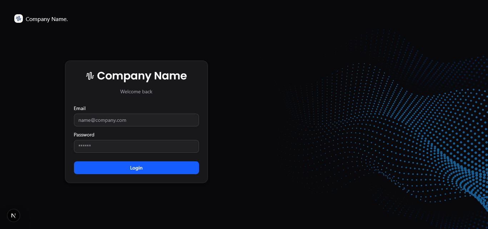
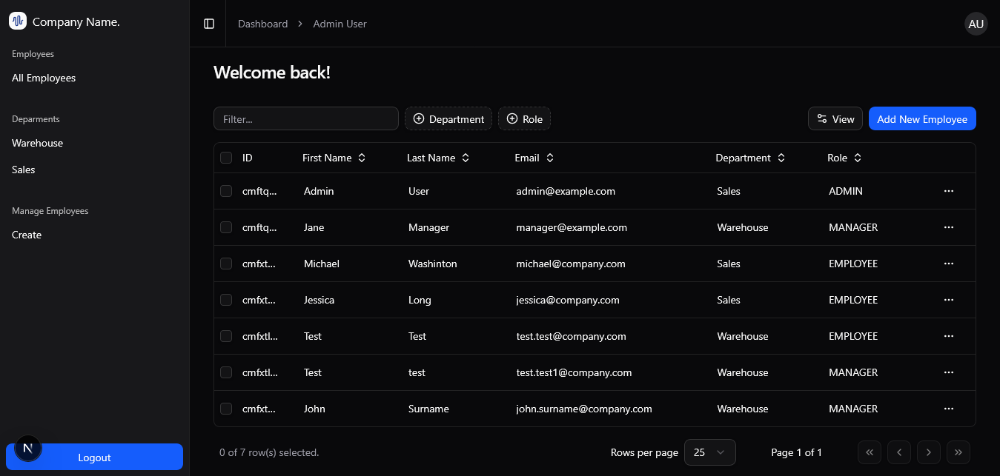
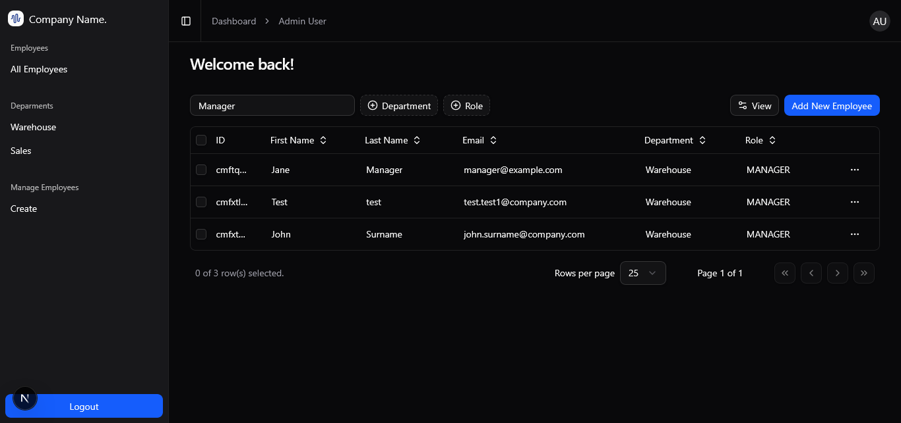
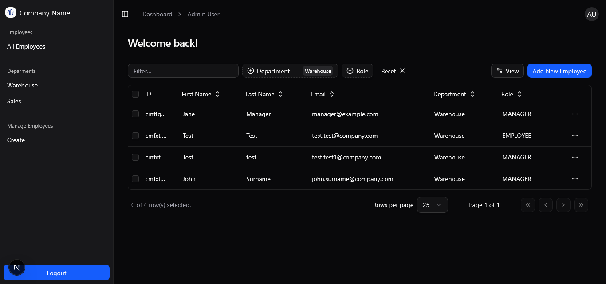
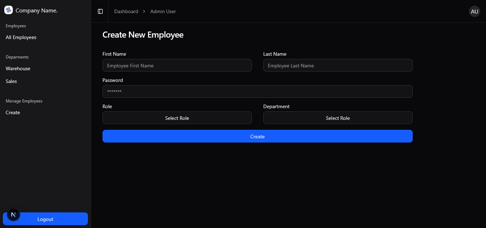
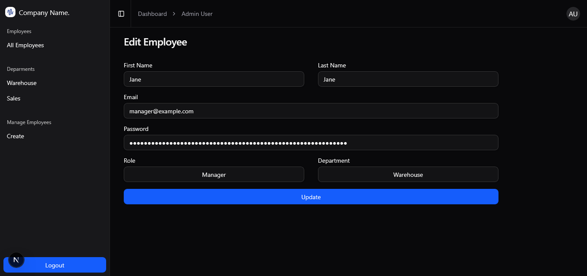

# 🏢 Employee Management Dashboard

A modern web Human Resources Admin dashboard for managing employees.  
Create, edit, and view employees with role-based access and auto-generated emails.

---

## 🚀 Features

- ➕ Create new employees with role and department assignment
- ✏️ Edit employee details
- 🔒 User authentication and role-based access (Admin / Manager / Employee)
- 💌 Auto-generate employee emails (`firstName.lastName@company.com`)

---

## 🖼️ Screenshots

### Login Page



### Dashboard



### Search



### Filter



### Create Employee Form



### Edit Employee Form



---

## 🛠️ Tech Stack

- **Frontend:** Next.js (React, TypeScript), TailwindCSS
- **Backend / Database:** Prisma, Neon
- **Auth:** Auth.js
- **Forms & Validation:** React Hook Form, Zod
- **Deployment:** Vercel

---

## ⚡ Getting Started

1. **Clone the repo by running** `git clone https://github.com/lukedevza/Admin-Dashboard.git`
2. **CD into the directory** `cd admin-dashboard`
3. **Install dependecies** `npm install`
4. **Prisma Setup** Run the following commands to generate: `npx prisma generate` `npx prisma db push` `npx prisma db seed`
5. **Run the development server** `npm run dev`
6. **Open your browser and navigate to** `https://localhost:3000`

## 🛠️ Environmnet Variables

You will need to create a `.env` file in the root of the project and add the following variables:

```env
DATABASE_URL=
AUTH_SECRET=
```
